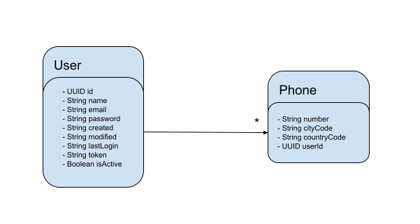

# API REST

## Contenido

* ### [Acerca del proyecto](#Acerca-del-proyecto)
* ### [Despliegue Local](#Despliegue-Local)


## Acerca del proyecto

Es un API RESTful donde se pueden crear, consultar y eliminar usuarios



## Despliegue Local

ESte servicio cuenta con una base de datos embebida H2 

`./gradlew bootRun`

Eso levantará un servicio HTTP por el puerto 8080
Una vez esté arriba, puedes correr los siguientes cURL:

``` bash
curl --location --request POST 'http://localhost:8080/user' \
--header 'token: 3a919ebe-ee68-4a45-a1d8-ced04e59b2a0' \
--header 'Content-Type: application/json' \
--data-raw '{
    "name": "jose",
    "email": "abc@ASDAS.com",
    "password": "Java2blog@",
    "phones": [
        {
            "number": "1234567",
            "citycode": "1",
            "contrycode": "57"
        }
    ]
}'

curl --location --request GET 'http://localhost:8080/user/abc@ASDAS.com/Java2blog@' \
--header 'token: 3a919ebe-ee68-4a45-a1d8-ced04e59b2a0'

curl --location --request DELETE 'http://localhost:8080/user/abc@ASDAS.com/Java2blog@' \
--header 'token: 3a919ebe-ee68-4a45-a1d8-ced04e59b2a0'
```


